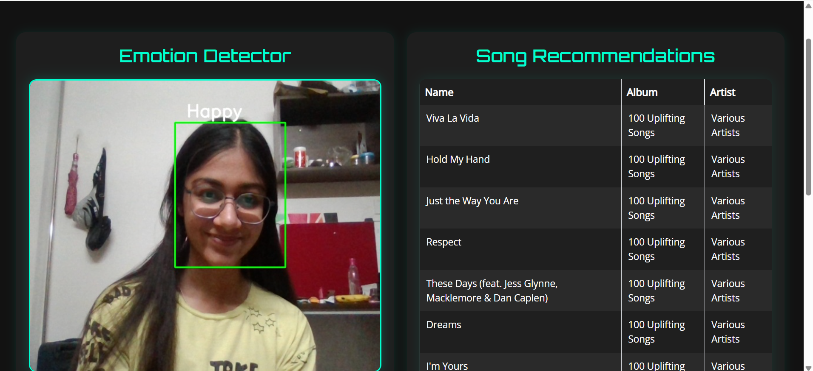

# FaceTune: Emotion-Based Music Recommender

A smart application that analyzes your facial expressions in real-time and recommends music to match your mood using the FER2013 dataset and Spotify integration.

## Overview

FaceTune creates a seamless connection between your emotions and music. Using computer vision and machine learning, it detects your facial expressions through your webcam, classifies your current emotion, and instantly suggests songs from curated Spotify playlists that complement how you're feeling.

## Key Features

- *Real-time Emotion Detection*: Analyzes webcam feed to identify 7 different emotional states
- *Personalized Music Recommendations*: Delivers Spotify song suggestions based on detected emotions
- *Modern UI Design*: Clean, intuitive interface with neumorphic elements
- *Direct Spotify Integration*: Click any song to open it directly in Spotify
- *Multi-threaded Processing*: Ensures smooth performance and responsive feedback

## Technical Implementation

### Dependencies

Install all required packages:

pip install -r requirements.txt

### Setup & Configuration

1. Create a Spotify Developer account and obtain API credentials
2. Enter your credentials in Spotipy.py in the auth_manager section
3. Run the application with python app.py
4. Allow camera access when prompted

### Technology Stack

- *Machine Learning*: Keras, TensorFlow
- *Computer Vision*: OpenCV
- *Music Integration*: Spotipy API wrapper
- *Web Framework*: Flask
- *Frontend*: HTML/CSS with neumorphic design

## Dataset Information

The emotion recognition model is trained on the FER2013 dataset, which contains facial expression images categorized into 7 emotion classes: angry, disgust, fear, happy, sad, surprise, and neutral. The dataset is available on [Kaggle](https://www.kaggle.com/msambare/fer2013).

Note: The dataset has class imbalance with the "happy" category being overrepresented.

## Model Architecture

The emotion classification model follows a sequential CNN architecture:
- *Convolutional Layers*: Multiple Conv2D layers with filter sizes ranging from 32 to 128 (ReLU activation)
- *Pooling*: MaxPooling2D layers with 2×2 pool size
- *Regularization*: Strategic dropout (0.25) to prevent overfitting
- *Classification*: Dense output layer with softmax activation for 7-class prediction
- *Training*: Categorical cross-entropy loss with Adam optimizer

The current model achieves approximately 66% accuracy on the validation set.

## Data Processing Pipeline

- *Image Preprocessing*: Normalization, grayscale conversion, and resizing to 48×48 pixels
- *Batch Processing*: Images processed in batches of 64 using Keras ImageDataGenerator
- *Augmentation*: Applied to enhance model generalization and robustness

## Project Structure

- *app.py*: Main Flask application entry point
- *camera.py*: Handles video capture, emotion detection, and music recommendation
- *Spotipy.py*: Manages Spotify API connections and playlist retrieval
- *utils.py*: Contains threading utilities for smooth video streaming
- *train.py*: Script for model training and evaluation 
- *templates/*: HTML templates for the web interface
- *static/*: CSS styles and JavaScript files
- *models/*: Trained model weights and architecture

## Future Enhancements

- *Database Integration*: Replace CSV storage with a proper database for song recommendations
- *Automated Playlist Updates*: Schedule regular updates to keep music recommendations fresh
- *Expanded Emotion Categories*: Add more nuanced emotional classification
- *User Profiles*: Save user preferences and recommendation history
- *Mobile Application*: Develop a companion mobile app for on-the-go use
- *Model Improvements*: Explore transformer-based architectures for higher accuracy

## Getting Started

1. Clone this repository
2. Install dependencies with pip install -r requirements.txt
3. Configure your Spotify API credentials
4. Run python app.py
5. Access the application at http://localhost:5000

## For training
1. Download the dataset from kaggle and put it in a data directory
2. run split.py
3. run train.py

## Acknowledgments

- FER2013 dataset creators and contributors
- Spotify for providing API access
- Open source computer vision and machine learning communities